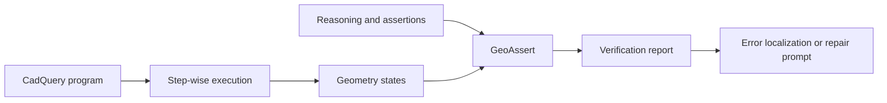

# GeoAssert

GeoAssert is a research prototype for studying executable verification of
LLM-generated CAD programs.

The project asks a practical question: when a model explains a CAD operation
and emits code, do its intermediate geometric claims agree with the geometry
that the code actually produces?

## Overview

GeoAssert parses lightweight `@assert` statements, executes a generated
CadQuery program step by step, measures each resulting geometry state, and
reports assertion failures at the associated modeling step. The current code
supports exploratory work on reasoning–execution consistency and controlled
CAD-program failures. It is not presented as a mature or validated benchmark.



## What this repository contains

- An assertion parser and evaluator for measurable CAD properties.
- Step-wise execution of common CadQuery modeling chains.
- Geometry snapshots covering volume, area, bounding boxes, topology, and
  approximate mirror symmetry.
- Geometry comparison utilities used by the experimental benchmark tools.
- Controlled mutation, assertion synthesis, filtering, and localization code.
- A minimal example and regression tests.

## Quick start

The verified environment uses Python 3.11 and CadQuery 2.7 from conda-forge.

```bash
git clone https://github.com/hechuxielianli/GeoAssert.git
cd GeoAssert
conda env create -f environment.yml
conda activate geoassert
python -m pip install -e . --no-deps
python examples/basic_verification.py
```

On Windows PowerShell, run the example as:

```powershell
python examples\basic_verification.py
```

The example should begin with:

```text
ASSERTION REPORT - 5 passed, 0 failed, 0 skipped
```

Run the tests with:

```bash
python -m pytest
```

## Assertion example

```python
from geoassert import check

program = '''
import cadquery as cq
result = cq.Workplane("XY").box(40, 30, 10)
'''

assertions = '''
@assert final bbox=(40,30,10) tol=1%
@assert final volume=12000 tol=1%
@assert final face_count=6
'''

print(check(program, assertions).render())
```

The assertion language and execution model are described in
[`docs/methodology.md`](docs/methodology.md).

## Repository structure

```text
GeoAssert/
├── src/geoassert/          # Verifier and geometry metrics
├── examples/               # Minimal runnable examples
├── tests/                  # Regression tests
├── benchmark/              # Experimental mutation tools and metadata
├── experiments/            # Scope and release-status notes
└── docs/                   # Method, benchmark, and reproduction notes
```

## Experimental benchmark

The `benchmark/` directory contains the generation pipeline for controlled
CadQuery program failures. It is an experimental, mutation-based evaluation
set, not a formally released benchmark. Dataset-sized outputs and raw model
responses are intentionally excluded. See [`benchmark/README.md`](benchmark/README.md).

## Current status

This repository is an exploratory research project under active development.
The public release focuses on the executable verifier and benchmark-generation
mechanics. It does not include a paper, training pipeline, or a curated set of
quantitative claims.

## Limitations

- Generated programs are executed as Python. GeoAssert is a research sandbox,
  not a security boundary; do not run untrusted code without process isolation.
- Step extraction targets common linear CadQuery chains. General control flow
  is treated as a coarser execution unit.
- Assertion usefulness depends on the quality and coverage of the assertions.
- Symmetry checking is sampling-based on Windows and depends on its tolerance
  and sampling density.
- The mutation taxonomy covers a limited set of CadQuery failure patterns and
  does not represent the full distribution of model errors.
- The current public release has limited model and benchmark coverage.

## Acknowledgements

GeoAssert builds on [CadQuery](https://cadquery.readthedocs.io/) and its
OpenCASCADE/OCP geometry stack, together with NumPy, SciPy, and trimesh.

## License

No license is currently specified. Until a license is selected, copyright law
applies and reuse permissions are not granted by this repository.
